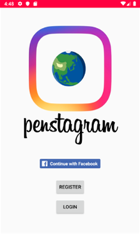
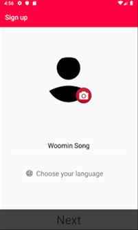
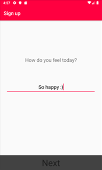
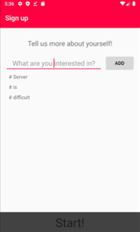
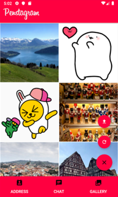
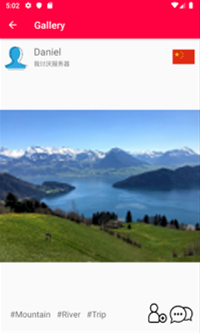
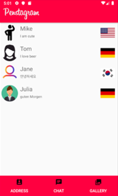
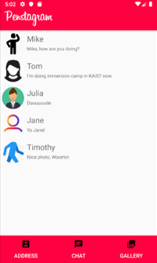
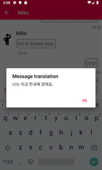

# Penstagram
Penstagram(PENpal + inSTAGRAM) is a penpal app, where you can find new friends who are interested in them.

펜스타그램은 사진을 업로드하고, 업로드한 사진을 통해 새로운 외국인 친구들을 만들 수 있는 펜팔 앱입니다.

## What is it?

## Used

## Features
### 1. Register and log in with Facebook

// Facebook login 기능 설명

### 2. Upload your photos

// 갤러리 탭, 사진 추가, refresh 기능 설명

### 3. Check other users' photos and add them as friends

// 사진 누르면 나오는 activity와 친구추가 기능, 연락처 탭 설명

### 4. Chat with your friends

// 연락처 탭에서 사람 누르면 연결되는 기능, 채팅 탭, 채팅방 기능 설명

### 5. Enhance your languae skills

// 구글번역 API 부분 설명
